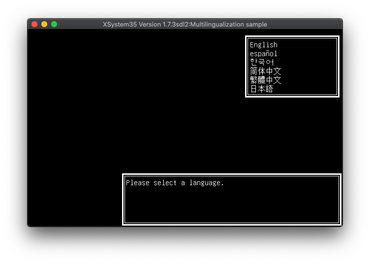

= Unicode mode

This document explains how to use xsys35c to translate games into
languages other than Japanese or English. To run such translated games,
https://github.com/kichikuou/xsystem35-sdl2[xsystem35] is required.

== The `unicode` option

Normally, strings in AliceSoft's scenario files are stored in CP932, a Japanese
character encoding used in Windows (it also covers English letters). xsys35c's
`unicode` option allows you to output a scenario file in UTF-8 character
encoding. The generated scenario does not work on the original System 3.x, but
it works on xsystem35 and in which you can use languages other than Japanese or
English.

== The `ZU` command

The `ZU` command tells xsystem35 that strings in the scenario are encoded in
UTF-8. This command must be executed before the first string is displayed in the
game. The command syntax is as follows:

  ZU 1:

`ZU 0:` will turn off the UTF-8 mode, but probably you won't use it.

The original System 3.x does not understand this command and hangs up if
executed.

== Translation workflow

1. Decompile the game with xref:xsys35dc.adoc[`xsys35dc`].
2. Open `xsys35c.cfg` file in the `decompiled` folder, and add the following
   line:

     unicode = true

3. Open `xsys35dc.hed` file in the same folder, to find out which source file
   (.ADV) is the first one to be executed. The file listed on the next line of
   `#SYSTEM35` is the first source file.
4. Open that ADV file, and add the following line to the beginning:

     ZU 1:

5. Build the scenario file with xref:xsys35c.adoc[`xsys35c`]. The generated
   scenario file has the same contents as the original, but is encoded in
   UTF-8.
6. Overwrite the original scenario file with the generated one (don't forget to
   back up the original file), and run it with `xsystem35`. It should just work
   as before. (If not, report a bug!)
7. Now you can put strings in the source files, in any languages. Modify the
   source files and repeat the steps 5-6.

== Fonts

The fonts come with xsystem35 only cover Japanese, so you will need to prepare a
font for your language.

If you are translating from Japanese, it would be useful to have a font that
covers both Japanese and your language while translating.
http://unifoundry.com/unifont/index.html[GNU Unifont] is a good candidate,
which is used in the example at the top of this document.

To change the font in xsystem35, create a file named `.xsys35rc` in the game
folder with the following contents (replace the file names):

  ttfont_gothic: your-sans-serif-font.ttf
  ttfont_mincho: your-serif-font.ttf

== Bugs / Limitations
- `xsys35c` does not yet support image replacement, so in order to translate
image files, you may need to use other tools.
